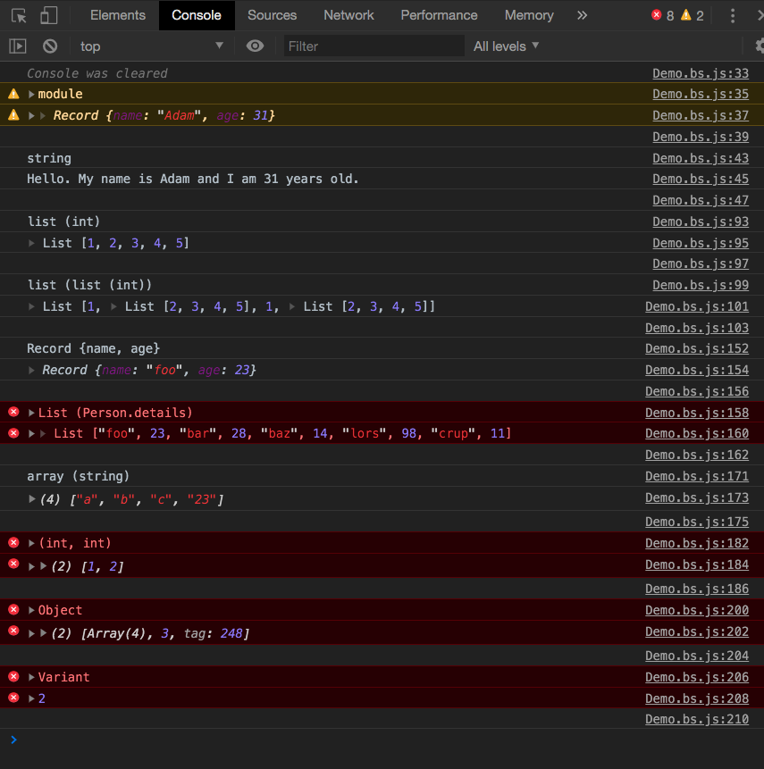
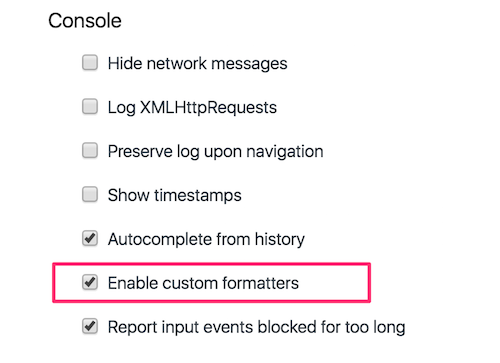

# ReasonML Console Formatter

### Status: ALPHA (only works with [Lists](https://reasonml.github.io/docs/en/list-and-array) & nested Lists) ⚠️

Transforms ReasonML types to a readable format when they are logged to the [Chrome console](https://developers.google.com/web/tools/chrome-devtools/console/?hl=es) or [NodeJS console](https://nodejs.org/api/console.html).

## How it works

Detects at runtime what kind of data structures are you logging into the console and maps them to ReasonML types.

Right now, BuckleScript has a debug flag (`"-bs-g"`) that labels some of the types with some JavaScript Symbols that can be catched by this extension and pretty prints them:

> This is the output of the tests, the future of this extension. Right now, you can take a look at `test/bs-demo/README.md` to get a better idea on what's keeping us to implement that! Thanks! 😄

Right now `bs-g`, aside from the labeling does a little bit of formatting as well. The down-site is that it contains a lot of bugs and isn't something easy to refactor. [@bobzhang](https://github.com/bobzhang) said that this part of Bucklescript's source code is a mess.

The idea is to create a extension that delivers a great developer experience that could replace at some point the flag and extract that debug logic from BuckleScript.

If you want to know more about this check `test/bs-demo/README.md` or DM me on the discord.

If you miss some type that you thing would be helpful, [let me know, by opening a new Issue!](https://github.com/davesnx/reason-formatter/issues/new)

### Use it

More information about the Chrome Extension comming soon...
The Chrome extension only works if you **enable Custom Formatters** in the DevTools settings.

### Step 1: Open DevTools settings

### Step 2: Enable custom formatters

## Development

1. Clone this repo
<!-- Remove those steps ^^ -->
2. Go to chrome extensions chrome://extensions
3. Click on load unpacked extension and select the "/extension" directory of the cloned repo
4. `npm install`
5. `npm run dev`
6. Open "/test/index.html" (`open /test/index.html`) to check the List implementation
7. Open "test/bs-demo/README.md and follow the steps there!

## Credit

Based on [immutable-devtools](https://github.com/andrewdavey/immutable-devtools) and inspired by the awesome [cljs-devtools](https://github.com/binaryage/cljs-devtools).
