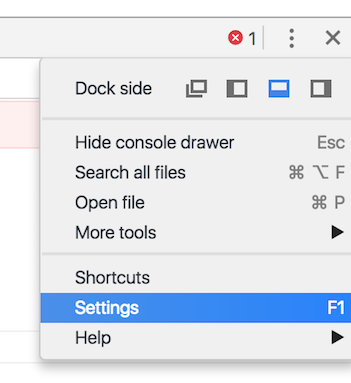

# ReasonML Console Formatter

Status: ALPHA

Transforms ReasonML types objects to a more readable format when they are logged to the [Chrome console](https://developers.google.com/web/tools/chrome-devtools/console/?hl=es) or [NodeJS console](https://nodejs.org/api/console.html). Pretty print on nested structures and no more `[1, [2, [3, [4, [5, 0]]]]]`.

More information about the Chrome Extension comming soon...

The Chrome extension will only work if you **enable Custom Formatters** in the DevTools settings.

### Step 1: Open DevTools settings

### Step 2: Enable custom formatters

## How it works

Detects at runtime what kind of data structures are you logging into the console and maps them to ReasonML types.

Currently supported:
- [x] Nested structures
- [x] Lists
- [x] Records (Currently waiting for BuckleScript to treat Records as JS Objects)
- [ ] Option
- [ ] Bool
- [ ] Working with `"bsc-flags": ["-bs-g"]`. [bucklescript/better-data-structures-printing-debug-mode](https://bucklescript.github.io/docs/en/better-data-structures-printing-debug-mode)
- [Miss some?](https://github.com/davesnx/reason-formatter/issues/new)

## Development

1. Clone this repo
2. Go to chrome extensions chrome://extensions
3. Click on load unpacked extension and select the "/extension" directory of the cloned repo
4. `npm install`
5. `npm run dev`
6. Open "/test/index.html" (`open /test/index.html`) to check run some tests

## Credit

Based on [immutable-devtools](https://github.com/andrewdavey/immutable-devtools).
