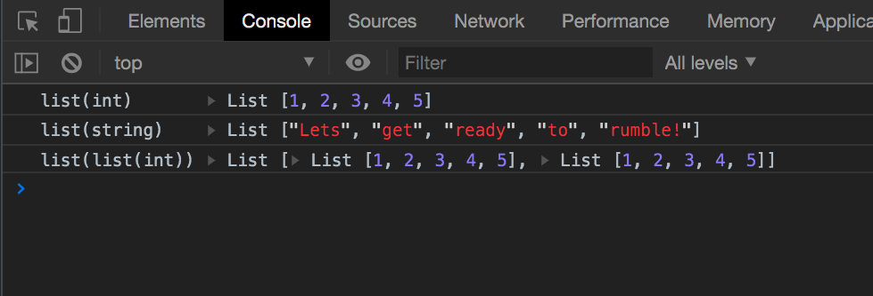

# Reason Formatter (as a Chrome Extension)

Transforms ReasonML types objects to a more readable format when they are logged to the [Chrome console](https://developers.google.com/web/tools/chrome-devtools/console/?hl=es) or [NodeJS console](https://nodejs.org/api/console.html).

More information about the Chrome Extension comming soon...

The Chrome extension will only work if you **enable Custom Formatters** in the DevTools settings.

### Step 1: Open DevTools settings

### Step 2: Enable custom formatters

## How it works

Detects at runtime what kind of data structures are you logging into the console and maps them to ReasonML types.

Currently supported:
- [x] Lists
- [x] Records
- [x] Nested
- [ ] Option
- [ ] Bool
- [ ] Working with `"bsc-flags": ["-bs-g"]`. [bucklescript/better-data-structures-printing-debug-mode](https://bucklescript.github.io/docs/en/better-data-structures-printing-debug-mode)

## Running the code locally

1. `npm install`
2. `npm run dev`
3. Load the "/extension" directory as an unpacked Chrome extension
4. Open "/test-page/index.html" to check everything looks as expected

Make sure to reload the extension after any changes.

## Credit

Based on [immutable-devtools](https://github.com/andrewdavey/immutable-devtools).
